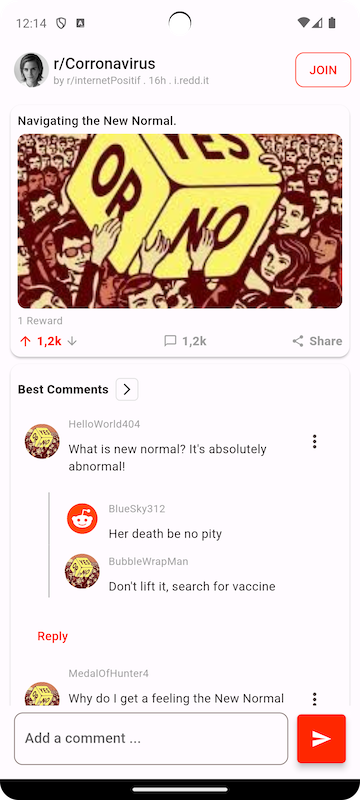

# Mobile App Developer Evaluation Task

Welcome to the repository for my mobile app development evaluation task. In this project, I was tasked with designing the user interface (UI) for a mobile application. The goal was to showcase my skills in creating an intuitive and visually appealing user experience.

## Screenshots
<p align="center">
 

</p>

## Project Structure

The project follows a structured organization to maintain clarity and modularity.

```plaintext
lib/
|-- main.dart
|-- src/
|   |-- models/
|   |   |-- reddit_data_model.dart
|   |
|   |-- screens/
|   |   |-- detail_screen.dart
|   |   |-- home_screen.dart
|   |   |-- trending_screen.dart
|   |
|   |-- utils/
|   |   |-- constants.dart
|   |
|   |-- widgets/
|       |-- detail_card_widget.dart
|       |-- detail_comment_card_header_widget.dart
|       |-- trending_card_widget.dart
|
|-- widgets_test.dart
|-- README.md
|-- pubspec.yaml
```

Getting Started
Follow these steps to get the Awesome Flutter UI Challenge up and running on your local machine.

1. Clone the repository:
```bash
git clone https://github.com/FransDroid/quavinci.git
```
2. Change into the project directory:
```bash
cd quavinci
```
3. Install dependencies:
```bash
flutter pub get
```
4. Run the app:
```bash
flutter run
```
# Feedback and Improvements
I welcome any feedback on the UI design and have identified areas for improvement, such as refining animation transitions and optimizing certain UI elements.

# Contact
For inquiries, please feel free to contact me at francis300@gmail.com or connect with me on [LinkedIn](https://www.linkedin.com/in/fransdroid/).

Thank you for considering my work for the evaluation!
